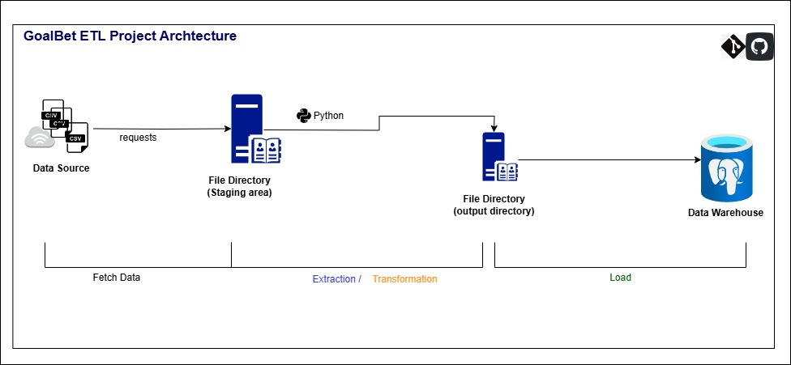

# GoalBet ETL Pipeline

## Project Description

GoalBet is a sports data analytics company that builds predictive models based on historical sports data. This project involves developing an ETL pipeline to extract, transform, and load football data into a PostgreSQL database.

## Project Architecture



## Setup Instructions

1. **Clone the repository**:
    ```sh
    git clone https://github.com/odetara/goalbet-etl-superstars.git

    cd goalbet-etl-superstars
    ```

2. **Install dependencies**:
    ```sh
    pip install -r requirements.txt
    ```

3. **Configure the database**: Update `config/config.yaml` with your database credentials and data source URLs.

4. **Run the ETL pipeline**:
    ```sh
    python etl_pipeline/main.py
    ```

## Data Sources

- [Data Documentation](https://www.football-data.co.uk/notes.txt)
- Data URLs:
  - https://www.football-data.co.uk/mmz4281/1920/E0.csv
  - https://www.football-data.co.uk/mmz4281/1920/E2.csv
  - https://www.football-data.co.uk/mmz4281/0203/E1.csv

## Data Fields

- **Div**: League Division
- **Date**: Match Date (dd/mm/yy)
- **Time**: Time of match kick off
- **HomeTeam**: Home Team
- **AwayTeam**: Away Team
- **FTHG**: Full Time Home Team Goals
- **FTAG**: Full Time Away Team Goals
